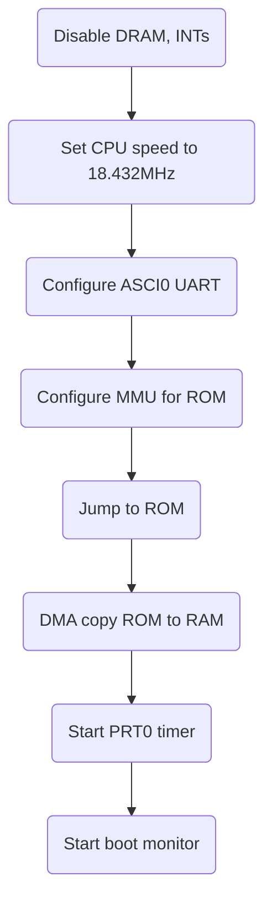

# TRS-20 boot ROM

The boot ROM for the TRS-20 is aimed at allowing self-hosted reprogramming, to minimise wear on the ROM socket. The code sets up the CPU, UART, and MMU, then enters a simple boot monitor that supports uploading more code to execute.

The boot monitor allows uploading code using Y-modem, and then jumping to the most recently uploaded code.
